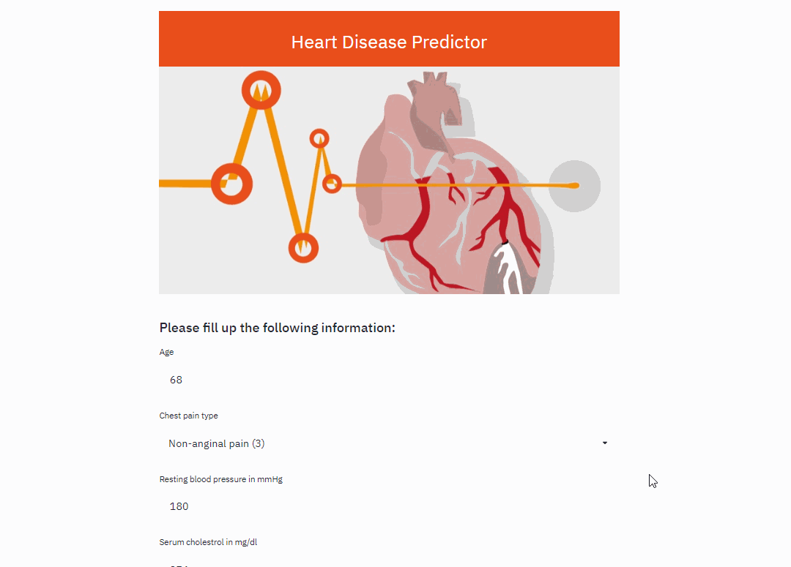
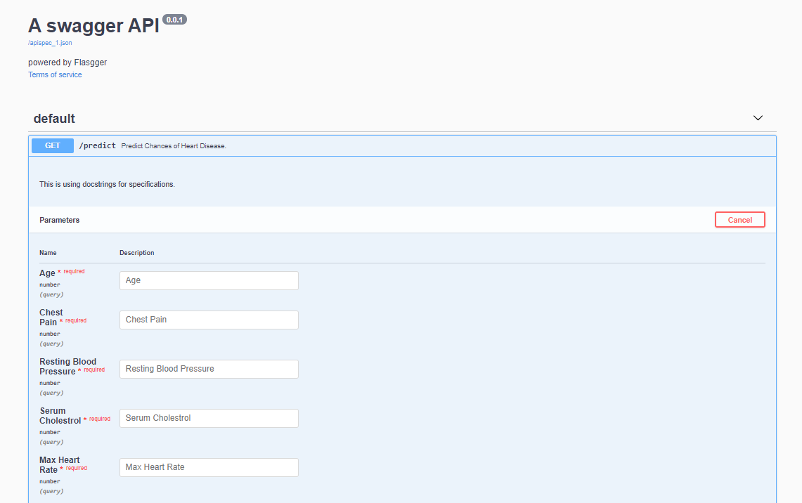

# Heart-disease-prediction
Heart disease or Cardiovascular disease is one of the biggest causes of mortality (i.e., causing 1 out of 4 deaths in the US) among the population of the world. Therefore, prediction of Cardiovascular disease is considered one of the important subjects in clinical data analysis. However, several contributory risk factors such as diabetes, high blood pressure, high cholesterol, abnormal pulse rate, etc. lead to cardiac arrest. So, the purpose of this work is to predict if any patient has the chance of having heart disease or not. With this objective, different models are trained using patients data collected by the Cleveland Clinic Foundation. The dataset (Cleveland) can be found in the 
following link:
https://archive.ics.uci.edu/ml/datasets/Heart+Disease

The following models are trained using the collected data.  
• SVM 
• Naive Bayes 
• Logistic Regression 
• Decision Tree 
• Random Forest 
• Extreme Gradient Boost 
• Light Gradient Boost 

The following techniques are applied: 
• KNN imputer has been applied to fill the missing values of the data. 
• 10 most important features are selected using embedded feature selection (e.g., Extra Tree) and by investigating correlation. 
• The top features are used to train the aforementioned models. 
• The best model achieved 90% accuracy (f1 = 0.90) in classifying patients with heart disease vs no heart disease. 

Finally, a web api (flask-api, flasgger) along with an UI (using streamlit) is developed to interact with the best model. Users can directly input information through the UI and check to see the chances of having a heart disease.

# Data:
Please check Cleveland.csv for the training data and for the detailed feature information please check 'heart-disease.names' file.

# Features:
### Selected Features

### Features Correlation

# Performance:

# How to run:
1. Please check Heart_Disease_Prediction.ipynb for the detailed analysis of different models.

2. To build and run the docker image of the API simply run the following commands:
> docker build -t heart_disease_api

> docker run -p 8000:8000 heart_disease_api

3. To run the API manually run the following commands from the cmd/terminal:
> python flask_api.py

go to this link from the browser: http://127.0.0.1:5000/apidocs

3.To Run the UI simply run the following commands in the terminal/cmd.
> streamlit run UI.py

go to this link from the browser: http://localhost:8501/

